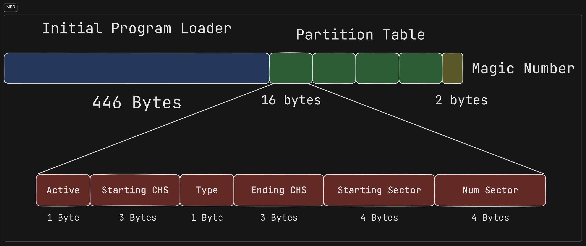
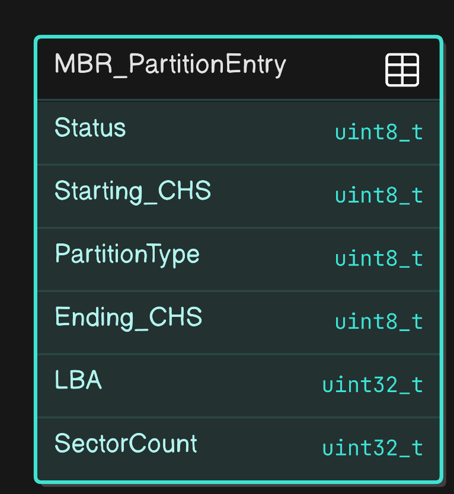
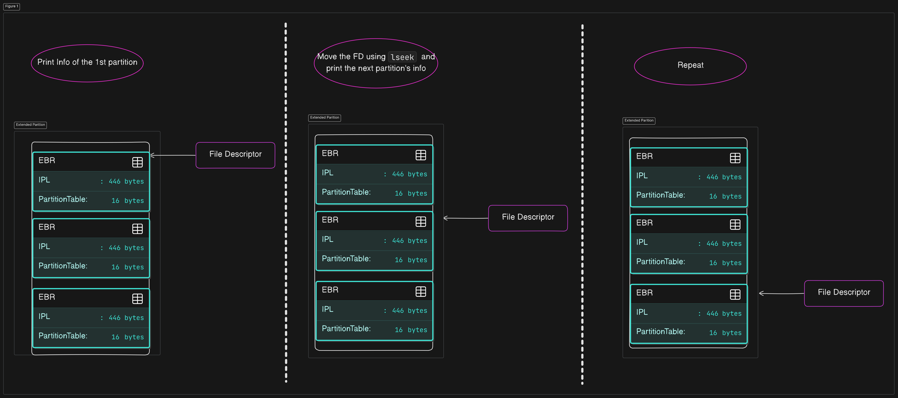
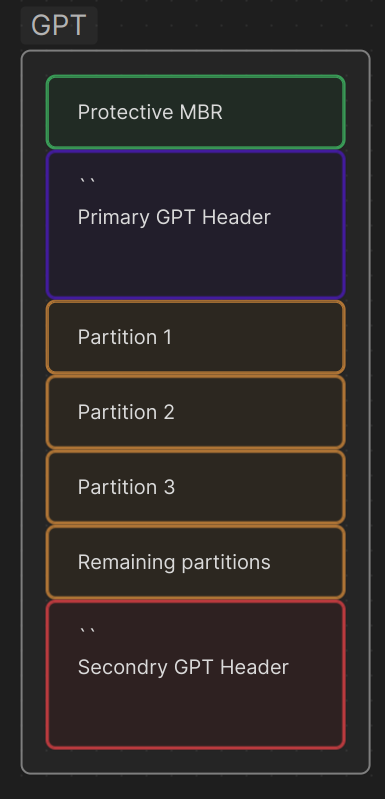
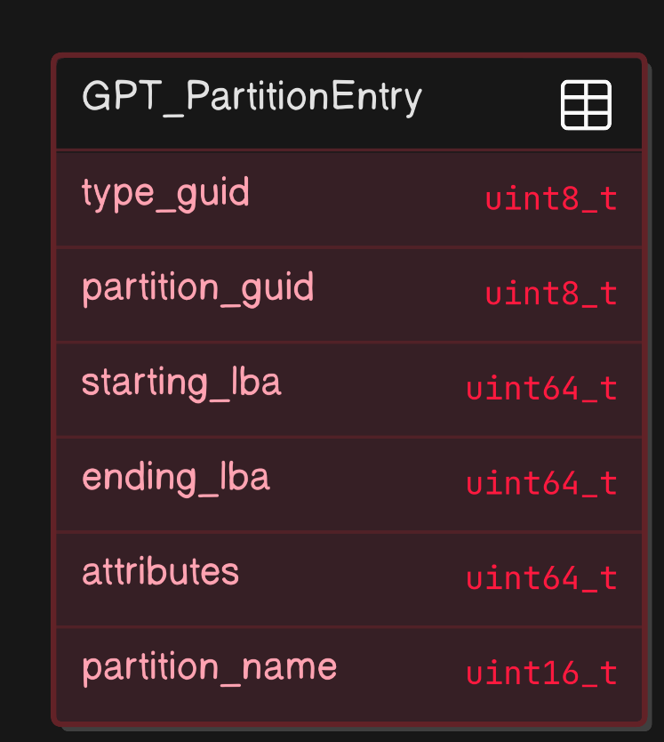
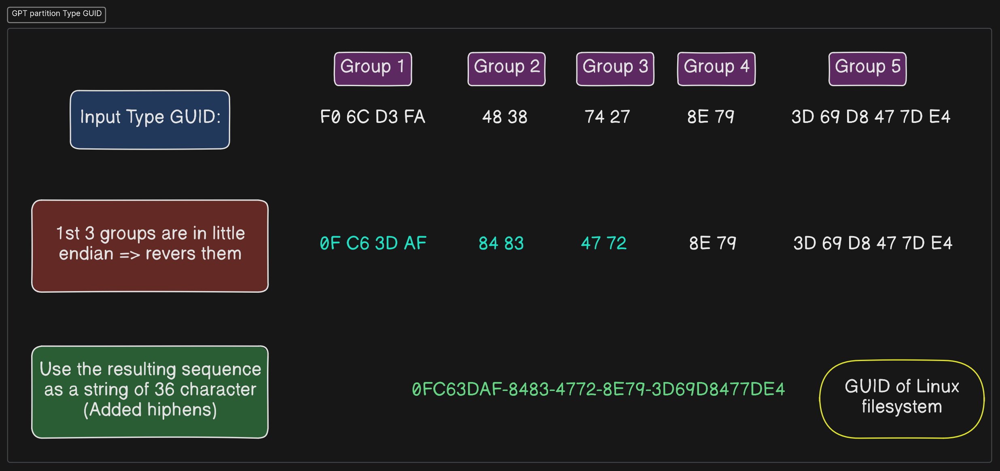
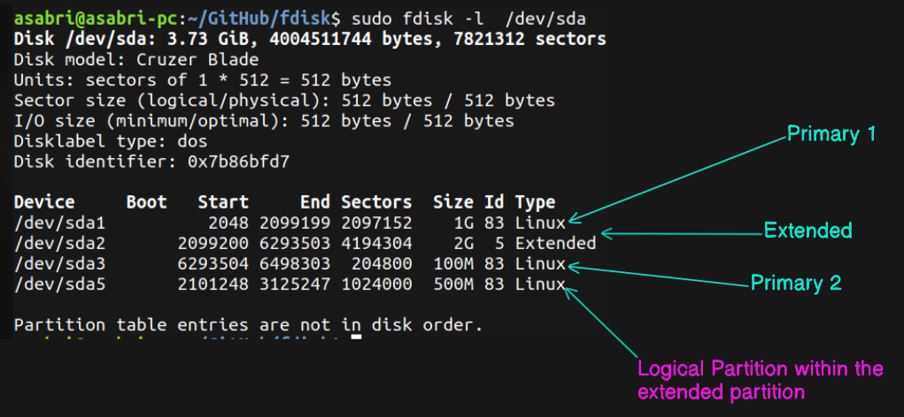
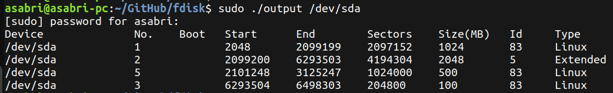
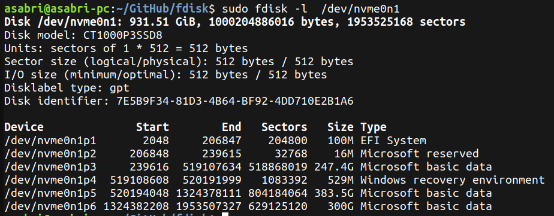
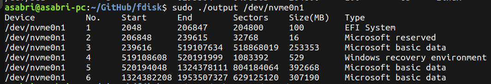

# FDISK Implementation

# 💡 Introduction
This is a custom implementation of `fdisk -l` command which takes `device file path` as an argument and prints its partitions with some details about each partition like starting and ending CHS, number of sectors, size of the partition and an ID represents the type of the partition.

This program supports MBR ( Master Boot Record ) and GPT ( GUID Partition Table ).

# MBR part Overview

The following figure illustrates the partition table of type MBR. It is located in the first sector in the hard disk. The first 446 bytes are reserved for the intial program loader ( IPL ). after that comes the Partition table. In MBR case, it contains 4 entries each represents a partition and contains some information about the partition. 

These partitions can be `primary` and `extended` partitions. Extended partitions are a special type of partition that allow the creation of more than four partitions on a disk. Instead of directly pointing to a filesystem, an extended partition contains a chain of Extended Boot Records (EBRs). Each EBR describes a logical partition and optionally points to the next EBR in the chain.

# MBR part Implementation

First of all, the first sector ( 512 Bytes ) is read from the file ( i.e.: /dev/sdx ). Then, the first 446 bytes ( representing the IPL ) of the first sector are skipped. The address of the 447th byte is casted to the following struct:

The casted address is an address to an array of 4 elements, each represents an entry in the partition table. After obtaining the address of the partition table, the program iterates through the 4 partition entries. Each entry in the partition table is of type `MBR_PartitionEntry` and contains the previously mentioned fields.

Then, the important fields are calculated as follows:

### Boot:

If the member variable `status` is equal to `0x80`, then this is a bootable partition. Thus, this field will contain a `*`. If it is not bootable, this field will be empty.

### Start:

It is simply equal to the member variable `LBA`.

### End:

It is calculated by adding the member `LBA` to the member `SectorCount`. 

### Sectors:

It is simply equal to the member `SectorCount`

### Size(MB):

It is calculated by multiplying the member `SectorCount` by the sector size in bytes ( 512 Bytes ).

### Id     

It is simply equal to the member `PartitionType`

### Type:

This value is obtained by mapping the ID obtained above to the correct string value. 

After obtaining the important data, they are printed on the screen. 

## Handling Extended Partitions

 - ### Checking for Extended Partition: 

If the type of the MBR partition is one of the following 3 types ( `0x05` , `0x0F` , `0x85` ), Then this is an `Extended Partition`. In order to print information about the logical partitions within the extended partition, the following steps are done:

1. Shift the file descriptor by a 512 bytes ( sector size ) to move to the first logical partition.

2. Read a sector ( 512 bytes ) from the current position of the file descriptor.

3. Skip the first 446 bytes.

4. Calculate the important information similar to the primary partitions and print them. 

5. Shift to the next logitcal partition ( the same as step 1 )

6. If the `LBA` of the current partition is equal to 0, This means you reached the final logical partition. If not, repeat from step 2.
 

# GPT Part Overview
The GUID Partition Table (GPT) is a more modern partitioning scheme compared to MBR. GPT is part of the UEFI standard and provides support for larger disks and more partitions. It replaces the traditional MBR partition table with a more flexible and robust structure.

## GPT Layout:
- The first sector of the disk contains a `protective MBR` to prevent legacy tools from misinterpreting the GPT disk as unpartitioned.

- The GPT header is located immediately after the protective MBR and contains metadata about the GPT layout.

- Following the GPT header, this section contains an array of partition entries that describe each partition on the disk. **There are 128 entries, each of size 128 bytes**

- `Backup GPT Header`, lLocated at the end of the disk, it provides redundancy in case the primary GPT header is damaged.

- `Backup Partition Entries`, which mirrors the primary partition entries for redundancy.

# GPT Part Implementation

First of all, the first layer ( the protective MBR layer ) is skipped using `lseek`. Then, the program will loop over the 128 entries and read each entry in the struct illustrated in the following figure. 

After that, the important data are calculated as follows:

### Start: 

It's simply the member `starting_lba`'s value   

### End: 

It's simply the member `ending_lba`'s value  

### Sectors :     

It's calculated by the difference between `ending_lba` and `starting_lba` + 1

### Size(MB):     

It's calculate by multiplying the number of sectors calculated above by the sector size in bytes   

### Type

This one is a little bit tricky. Type of partition in GPT is represented using a GUID ( Global Unique Identifier ). This is a 36 character string. It's saved in the GPT partition table in a binary format ( 16 bytes ). It's also divied into 5 groups:

- The first group represents 4 bytes
- The second group represents 2 bytes
- The third group represents 2 bytes
- The fourth group represents 2 bytes
- The fifth group represents 6 bytes 

The first 3 groups are saved in a `little endian` format, while the last 2 groups are saved in a `big endian` format. Thus, the first 3 groups will be reversed while the other 2 groups will remain the same. Then, `Hipghens - ` are added to separate the groups to result in a 36 character long string. Finally, this string is compared with the strings saved in a text file to detect the type of the partition. 

 The following figure illustrates how to extract the type of the partition from the saved GUID. 

After obtaining these information, they will be printed on the screen. 

# Output samples

## MBR Hard disk
First, let's test an MBR hard. The following image shows the output of the original `fdisk -l`. It is tested on a hard which contains 2 primary partitions, 1 extendend partition and 1 logical partition. 

Now let's test our program on the same hard. The following image shows the output of our custom `fdisk` command. 

## GPT Hard disk

Here is the output of the original `fdisk -l` running on a GPT hard disk. 

Now let's test our program on the same hard. The following image shows the output of our custom `fdisk` command. 

